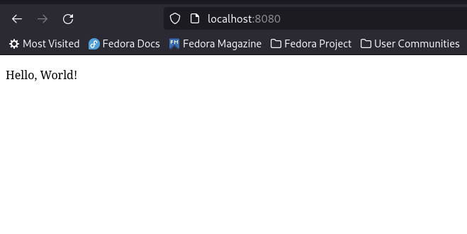
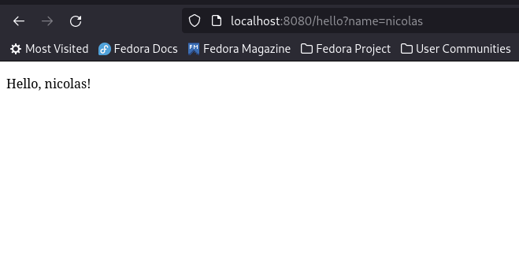

# Ejemplo de Despliegue Heroku

Repositorio con una aplicación simple de Spring Boot, que se utilizará como ejemplo
para hacer un despliegue a través de la plataforma de Heroku.

## Ejemplo de uso

Aplicación default

------------------------------------
Aplicación usando variable

